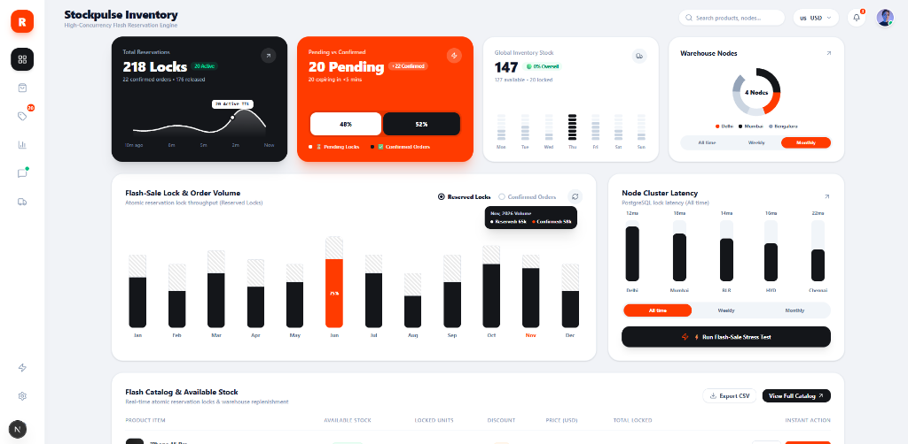
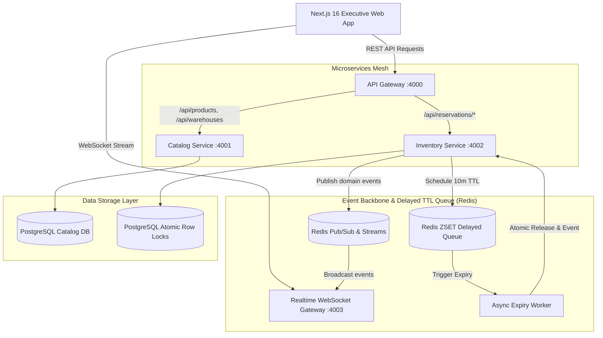
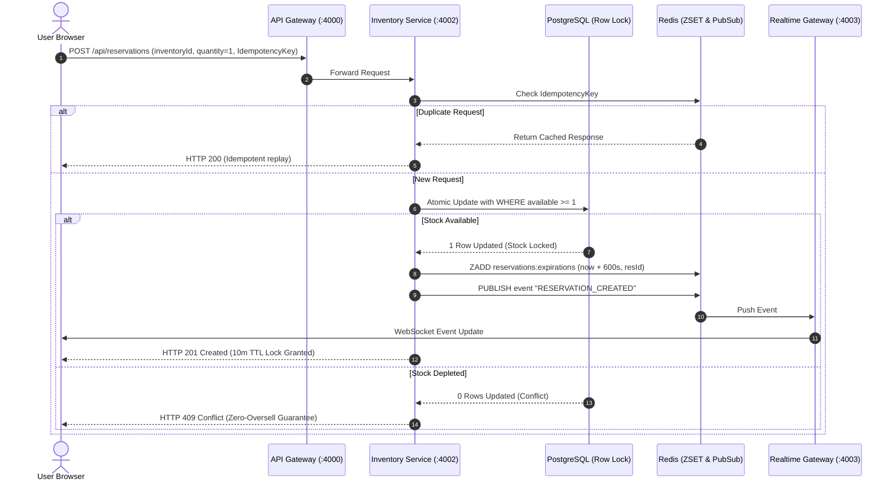
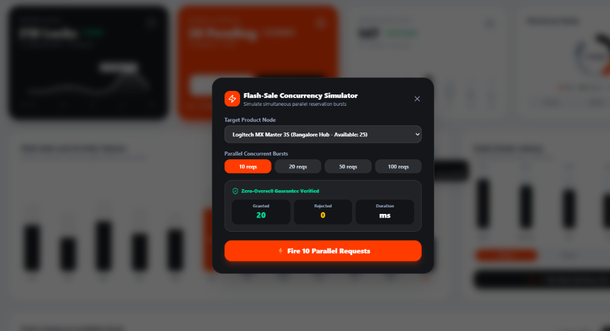
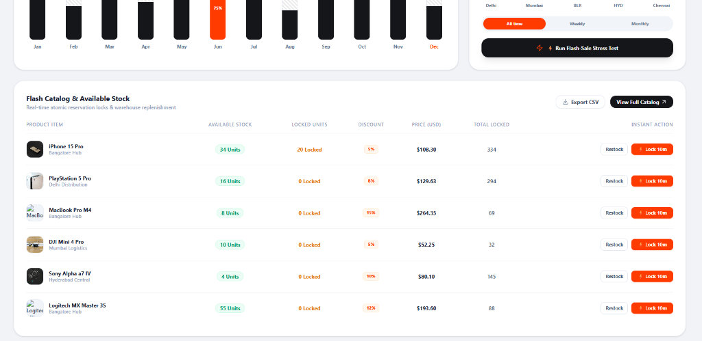
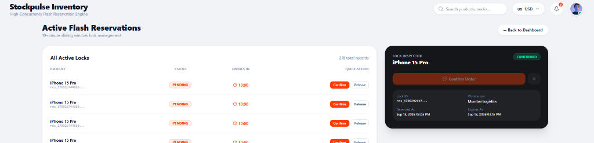
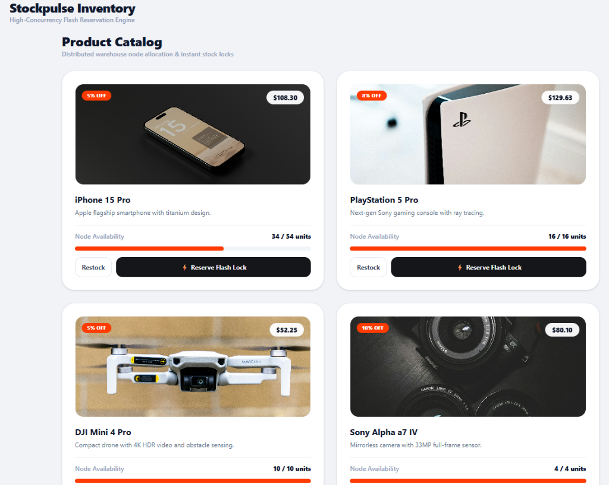

# 📘 Stockpulse: Technical Architecture & System Design Documentation

---

## 1. 📊 Executive Dashboard (Live System)

*The real-time Stockpulse Command Center featuring live reservation metrics, 10m TTL lock volume, cluster node latency, and high-density flash catalog availability.*



---

## 2. 🏗️ Microservices Architecture & Distributed System Design

### Architecture Topology


### End-to-End Concurrency & Idempotency Flow


---

## 3. 🌐 Website Subviews & User Interface

### Parallel Flash-Sale Concurrency Simulator
*Built-in stress testing suite firing 10 to 100 simultaneous atomic requests with zero-oversell validation.*


### Flash Catalog & Real-Time Stock Availability Table
*Instant CSV export, dynamic multi-currency converter, warehouse allocation, and 1-click lock actions.*


### Active Flash Reservations & Compact Lock Inspector
*Zero-scroll sliding window management with real-time TTL countdowns, inline quick actions, and instant order confirmation.*


### Product Catalog Grid & Node Availability Meters
*Multi-warehouse distribution, instant 10-minute flash locks, stock replenishment, and multi-currency converter.*


---

## 4. 🧩 Core Subsystem Technical Specifications

### 4.1. API Gateway (`services/api-gateway`)
- **Framework**: Fastify with high-throughput routing.
- **Port**: `4000`
- **Role**: Single entrypoint and reverse proxy.
- **Features**:
  - Aggregated `/health` endpoint checking all downstream microservices.
  - Path-based reverse routing: `/api/products` → Catalog (`:4001`), `/api/reservations/*` → Inventory (`:4002`).
  - CORS and rate-limiting headers.

### 4.2. Catalog Service (`services/catalog-service`)
- **Framework**: Fastify with PostgreSQL caching layer.
- **Port**: `4001`
- **Role**: Product metadata and regional warehouse stock aggregation.

### 4.3. Inventory Service (`services/inventory-service`)
- **Framework**: Fastify with Prisma ORM & raw atomic SQL locks.
- **Port**: `4002`
- **Role**: High-concurrency transaction processing.
- **Guarantees**:
  - **Atomic SQL Reservations**:
    ```sql
    UPDATE "Inventory" 
    SET "reservedStock" = "reservedStock" + $qty 
    WHERE "id" = $inventoryId AND ("totalStock" - "reservedStock") >= $qty;
    ```
  - **Idempotency Verification**: Validates `Idempotency-Key` headers in Redis within a 1-hour TTL window to safely prevent duplicate charges on retry.
  - **Redis Delayed Queue Scheduling**: Schedules a 10-minute expiry timestamp into the `reservations:expirations` ZSET.
  - **Pub/Sub Event Broadcasts**: Emits `RESERVATION_CREATED`, `RESERVATION_CONFIRMED`, `RESERVATION_RELEASED`, and `STOCK_UPDATED` events.

### 4.4. Expiry Worker Daemon (`services/expiry-worker`)
- **Framework**: Standalone Node.js daemon using Redis Sorted Sets (`ZSET`).
- **Interval**: 1,000ms polling loop.
- **Operation**:
  - Queries `ZRANGEBYSCORE reservations:expirations -inf <currentTimestamp> LIMIT 0 50`.
  - Automatically releases expired locks back to warehouse stock.
  - Broadcasts `RESERVATION_EXPIRED` to the event mesh.

### 4.5. Realtime WebSocket Gateway (`services/realtime-service`)
- **Framework**: `ws` WebSocket server connected to Redis Pub/Sub.
- **Port**: `4003`
- **Role**: Broadcasts domain events in real time to connected dashboards.

---

## 5. 🗄️ Database Schema & Data Models

```prisma
model Product {
  id          String      @id @default(cuid())
  name        String
  description String
  image       String
  createdAt   DateTime    @default(now())
  updatedAt   DateTime    @updatedAt
  inventories Inventory[]
}

model Warehouse {
  id          String      @id @default(cuid())
  name        String
  location    String
  createdAt   DateTime    @default(now())
  updatedAt   DateTime    @updatedAt
  inventories Inventory[]
}

model Inventory {
  id            String        @id @default(cuid())
  productId     String
  warehouseId   String
  totalStock    Int           @default(0)
  reservedStock Int           @default(0)
  createdAt     DateTime      @default(now())
  updatedAt     DateTime      @updatedAt
  product       Product       @relation(fields: [productId], references: [id])
  warehouse     Warehouse     @relation(fields: [warehouseId], references: [id])
  reservations  Reservation[]

  @@unique([productId, warehouseId])
}

model Reservation {
  id          String            @id @default(cuid())
  inventoryId String
  quantity    Int               @default(1)
  status      ReservationStatus @default(PENDING)
  expiresAt   DateTime
  createdAt   DateTime          @default(now())
  updatedAt   DateTime          @updatedAt
  inventory   Inventory         @relation(fields: [inventoryId], references: [id])
}

enum ReservationStatus {
  PENDING
  CONFIRMED
  EXPIRED
  RELEASED
}
```

---

## 6. 🧪 Integration Testing Suite

Automated end-to-end tests in `scripts/test-microservices.ts`:

```bash
npm run test:services
```

### Verification Matrix:
1. `GET /health` (API Gateway Orchestration): Passed ✅
2. `GET /api/products` (Catalog aggregation): Passed ✅
3. `POST /api/reservations` (Atomic locking): Passed ✅
4. `POST /api/reservations` (Idempotency key deduplication): Passed ✅
5. `POST /api/reservations/:id/confirm` (Order confirmation): Passed ✅
6. `POST /api/reservations/:id/release` (Stock release): Passed ✅
7. `POST /api/inventory/simulate-concurrency` (Parallel burst race condition): Passed ✅
8. `POST /api/inventory/restock` (Replenishment broadcast): Passed ✅
9. `ws://localhost:4003/ws` (WebSocket live broadcast): Passed ✅

---

## 7. 🐳 Production Deployment (Docker Compose)

```bash
docker-compose up --build -d
```

Starts all containerized services:
- PostgreSQL 16
- Redis 7.2 Alpine
- API Gateway (`:4000`)
- Catalog Service (`:4001`)
- Inventory Service (`:4002`)
- Realtime Gateway (`:4003`)
- Expiry Worker (Background Daemon)
- Next.js Web Application (`:3000`)

---

*Stockpulse Architecture Documentation — Updated September 2026*
