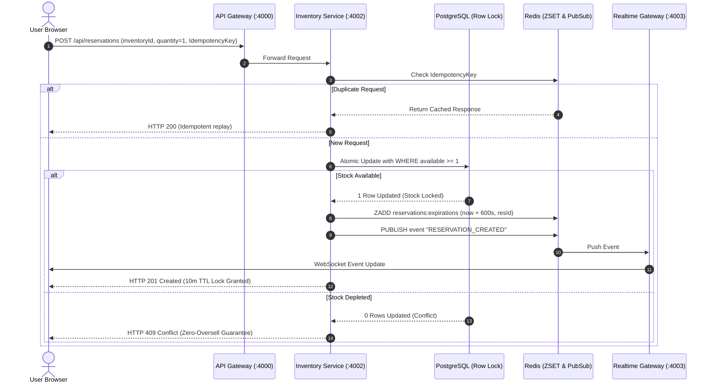

# 📘 Stockpulse: Technical Architecture & System Design Documentation

---

## 1. Executive Summary

**Stockpulse** is a distributed, high-concurrency inventory reservation and flash-sale management system. It solves the classic e-commerce concurrency challenge: **how to handle millions of simultaneous checkout requests during flash sales while guaranteeing 0% overselling, maintaining low database latency, and providing real-time inventory visibility.**

---

## 2. Distributed Architecture Overview

```
                                      ┌────────────────────────┐
                                      │   Next.js 16 Web App   │
                                      │   (Executive UI Dock)  │
                                      └───────────┬────────────┘
                                                  │
                         ┌────────────────────────┴────────────────────────┐
                         │ REST API                                        │ WebSockets (ws://)
                         ▼                                                 ▼
               ┌───────────────────┐                             ┌───────────────────┐
               │    API Gateway    │                             │ Realtime Gateway  │
               │    (Port 4000)    │                             │    (Port 4003)    │
               └─────────┬─────────┘                             └─────────▲─────────┘
                         │                                                 │
          ┌──────────────┴──────────────┐                                  │
          ▼                             ▼                                  │
┌───────────────────┐         ┌───────────────────┐                        │
│  Catalog Service  │         │ Inventory Service │                        │
│    (Port 4001)    │         │    (Port 4002)    │                        │
└─────────┬─────────┘         └─────────┬─────────┘                        │
          │                             │                                  │
          ▼                             ├───────────────────────┐          │
┌───────────────────┐                   ▼                       ▼          │
│ PostgreSQL / Seed │         ┌───────────────────┐   ┌──────────────────┐ │
│   (Catalog DB)    │         │ PostgreSQL Locked │   │  Redis Pub/Sub   ├─┘
└───────────────────┘         │  (Inventory DB)   │   │  & ZSET (Queue)  │
                              └───────────────────┘   └─────────┬────────┘
                                                                │
                                                                ▼
                                                      ┌───────────────────┐
                                                      │   Expiry Worker   │
                                                      │   (Daemon TTL)    │
                                                      └───────────────────┘
```

---

## 3. Core Technical Subsystems

### 3.1. API Gateway (`services/api-gateway`)
- **Framework**: Fastify with high-throughput routing.
- **Port**: `4000`
- **Role**: Reverse proxy and single entrypoint for all frontend API calls.
- **Features**:
  - Aggregated `/health` endpoint checking Catalog, Inventory, and Realtime health.
  - Path-based routing: `/api/products` → Catalog (`:4001`), `/api/reservations/*` → Inventory (`:4002`).
  - CORS header handling and request-id tracing.

### 3.2. Catalog Service (`services/catalog-service`)
- **Framework**: Fastify with PostgreSQL caching layer.
- **Port**: `4001`
- **Role**: Product catalog querying and multi-warehouse stock aggregation.
- **Endpoints**:
  - `GET /api/products`: Returns all items, images, descriptions, and linked warehouse availability.
  - `GET /api/warehouses`: Returns warehouse fulfillment node locations and capacity.

### 3.3. Inventory Service (`services/inventory-service`)
- **Framework**: Fastify with Prisma ORM & raw atomic SQL locks.
- **Port**: `4002`
- **Role**: High-concurrency transaction processing.
- **Guarantees**:
  - **Atomic SQL Reservations**:
    ```sql
    UPDATE "Inventory" 
    SET "reservedStock" = "reservedStock" + $qty 
    WHERE "id" = $inventoryId AND ("totalStock" - "reservedStock") >= $qty;
    ```
  - **Idempotency Verification**: Validates `Idempotency-Key` headers in Redis within a 1-hour TTL window to safely prevent duplicate charges on retry.
  - **Redis Delayed Queue Scheduling**: Schedules a 10-minute expiry timestamp into the `reservations:expirations` ZSET.
  - **Pub/Sub Event Broadcasts**: Emits `RESERVATION_CREATED`, `RESERVATION_CONFIRMED`, `RESERVATION_RELEASED`, and `STOCK_UPDATED` events.

### 3.4. Expiry Worker Daemon (`services/expiry-worker`)
- **Framework**: Standalone Node.js process using Redis Sorted Sets (`ZSET`).
- **Interval**: 1,000ms polling loop.
- **Operation**:
  - Queries `ZRANGEBYSCORE reservations:expirations -inf <currentTimestamp> LIMIT 0 50`.
  - For each expired reservation ID, invokes the Inventory service atomic release procedure.
  - Removes the item from the ZSET and broadcasts `RESERVATION_EXPIRED` to the event mesh.

### 3.5. Realtime WebSocket Gateway (`services/realtime-service`)
- **Framework**: `ws` WebSocket server connected to Redis Pub/Sub.
- **Port**: `4003`
- **Role**: Broadcasts domain events in real time to connected dashboards, enabling live counter updates without HTTP polling overhead.

---

## 4. Concurrency & Race-Condition Safety Model



---

## 5. Database Schema & Data Models

```prisma
model Product {
  id          String      @id @default(cuid())
  name        String
  description String
  image       String
  createdAt   DateTime    @default(now())
  updatedAt   DateTime    @updatedAt
  inventories Inventory[]
}

model Warehouse {
  id          String      @id @default(cuid())
  name        String
  location    String
  createdAt   DateTime    @default(now())
  updatedAt   DateTime    @updatedAt
  inventories Inventory[]
}

model Inventory {
  id            String        @id @default(cuid())
  productId     String
  warehouseId   String
  totalStock    Int           @default(0)
  reservedStock Int           @default(0)
  createdAt     DateTime      @default(now())
  updatedAt     DateTime      @updatedAt
  product       Product       @relation(fields: [productId], references: [id])
  warehouse     Warehouse     @relation(fields: [warehouseId], references: [id])
  reservations  Reservation[]

  @@unique([productId, warehouseId])
}

model Reservation {
  id          String            @id @default(cuid())
  inventoryId String
  quantity    Int               @default(1)
  status      ReservationStatus @default(PENDING)
  expiresAt   DateTime
  createdAt   DateTime          @default(now())
  updatedAt   DateTime          @updatedAt
  inventory   Inventory         @relation(fields: [inventoryId], references: [id])
}

enum ReservationStatus {
  PENDING
  CONFIRMED
  EXPIRED
  RELEASED
}
```

---

## 6. Frontend UI/UX Design System

- **Layout Structure**: Fixed 80px left vertical dock, transparent luxury topbar, and scrollable fluid dashboard canvas.
- **Color Tokens**:
  - `Electric Orange Accent`: `#ff3b00` (Used for primary locks, active states, and call-to-actions).
  - `Obsidian Contrast Dark`: `#14161a` (Used for primary hero cards, dark controls, and lock inspector).
  - `Surface Gray`: `#f1f3f7` (Background canvas).
  - `Pure White`: `#ffffff` (Metric cards and data tables).
- **Interactive Views**:
  - **Overview**: 4 Hero metric widgets, 12-month lock throughput bar charts with hover tooltips, node cluster latency breakdown, and live product catalog table.
  - **Catalog**: Grid view with stock progress meters, currency converter, and restock modal triggers.
  - **Flash Locks (Reservations)**: Ultra-compact Lock Inspector with zero-scroll top action buttons, live TTL countdown timers, and inline quick-action rows.
  - **Analytics**: Conversion rate calculations, average lock duration, and distributed infrastructure metrics.
  - **Live Mesh**: Terminal event stream rendering incoming WebSocket messages.
  - **Warehouses**: Node capacity and distributed stock replenishment.
  - **Slide-Over Notification Drawer**: Event feed drawer accessible via topbar bell.

---

## 7. Verification & Automated Testing

Stockpulse features automated end-to-end integration tests in `scripts/test-microservices.ts`:

```bash
npm run test:services
```

### Test Suite Execution Matrix:
1. `GET /health` (API Gateway Orchestration): Passed ✅
2. `GET /api/products` (Catalog aggregation): Passed ✅
3. `POST /api/reservations` (Atomic locking): Passed ✅
4. `POST /api/reservations` (Idempotency key deduplication): Passed ✅
5. `POST /api/reservations/:id/confirm` (Order confirmation): Passed ✅
6. `POST /api/reservations/:id/release` (Stock release): Passed ✅
7. `POST /api/inventory/simulate-concurrency` (Parallel burst race condition): Passed ✅
8. `POST /api/inventory/restock` (Replenishment broadcast): Passed ✅
9. `ws://localhost:4003/ws` (WebSocket live broadcast): Passed ✅

---

## 8. Deployment & Production Operations

### Docker Compose
```bash
docker-compose up --build -d
```
Starts:
- `db`: PostgreSQL 16
- `redis`: Redis 7.2 Alpine
- `api-gateway`: Node.js container on port `4000`
- `catalog-service`: Node.js container on port `4001`
- `inventory-service`: Node.js container on port `4002`
- `realtime-service`: WebSocket container on port `4003`
- `expiry-worker`: Background worker daemon
- `web`: Next.js production server on port `3000`

---

*Stockpulse Architecture Documentation — Updated September 2026*
