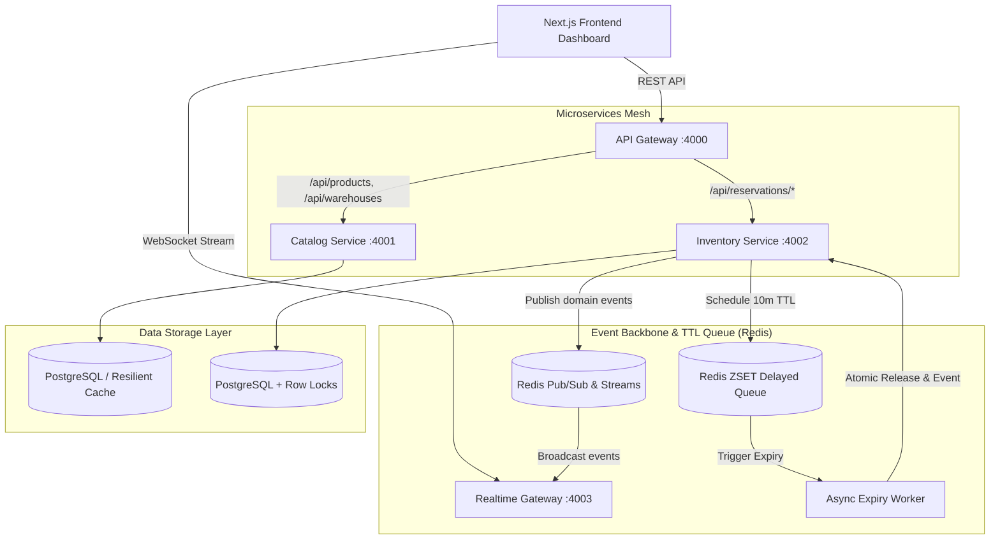

# ⚡ Stockpulse: Distributed Microservices Flash-Sale & Inventory Architecture

**Stockpulse** is a high-concurrency, event-driven microservices platform designed for high-scale flash sales, real-time inventory synchronization, and zero-oversell reservation guarantees.

---

## 🏗️ Architecture Overview



---

## 🧩 Microservices Breakdown

| Service | Port / Protocol | Responsibilities |
| :--- | :--- | :--- |
| **API Gateway** | `http://localhost:4000` | Unified reverse proxy, route routing, aggregated `/health` checks, rate limiting, and CORS. |
| **Catalog Service** | `http://localhost:4001` | Product catalog, warehouse inventory aggregation, metadata queries, and caching. |
| **Inventory Service** | `http://localhost:4002` | High-concurrency atomic reservation locking, Redis idempotency (`Idempotency-Key`), checkout confirmation, and release. |
| **Expiry Worker** | Background Daemon | Monitors the Redis Sorted Set (`ZSET`) delayed queue with millisecond precision, automatically releasing expired reservations. |
| **Realtime Gateway** | `ws://localhost:4003/ws` | WebSocket server broadcasting live inventory updates, order confirmations, and reservation timer ticks to all dashboards. |
| **Shared Core** | `packages/shared` | Common domain types, Zod validators, Redis distributed lock primitives, structured logger, and event bus. |

---

## 🚀 Quick Start & Running Locally

### 1. Run Everything Concurrently
```bash
# Starts API Gateway, Catalog, Inventory, Expiry Worker, Realtime Gateway + Next.js App
npm run dev:all
```

### 2. Run Only Backend Microservices Mesh
```bash
npm run dev:services
```

### 3. Run Microservices Individually (Independent Scaling)
```bash
npm run dev:gateway      # Port 4000
npm run dev:catalog      # Port 4001
npm run dev:inventory    # Port 4002
npm run dev:realtime     # Port 4003
npm run dev:expiry       # Background Worker
```

### 4. Run Automated Microservices Integration Tests
```bash
npm run test:services
```

### 5. Docker Orchestration (Production Ready)
```bash
docker-compose up --build
```

---

## 🔒 Concurrency & Race-Condition Prevention

1. **Row-Level Atomic Locking**: Inventory updates execute atomic SQL operations:
   ```sql
   UPDATE "Inventory" 
   SET "reservedStock" = "reservedStock" + 1 
   WHERE "id" = {id} AND ("totalStock" - "reservedStock") >= 1;
   ```
2. **Redis Idempotency**: All `POST /api/reservations` requests check `Idempotency-Key` in Redis to prevent duplicate charges during network retries.
3. **Decoupled 10-Minute Expiry Engine**: Eliminated slow, blocking database cron sweeps by utilizing a Redis ZSET delayed queue.
4. **WebSocket Live Sync**: Instant push updates (`RESERVATION_CREATED`, `RESERVATION_CONFIRMED`, `RESERVATION_EXPIRED`) to connected frontends.
