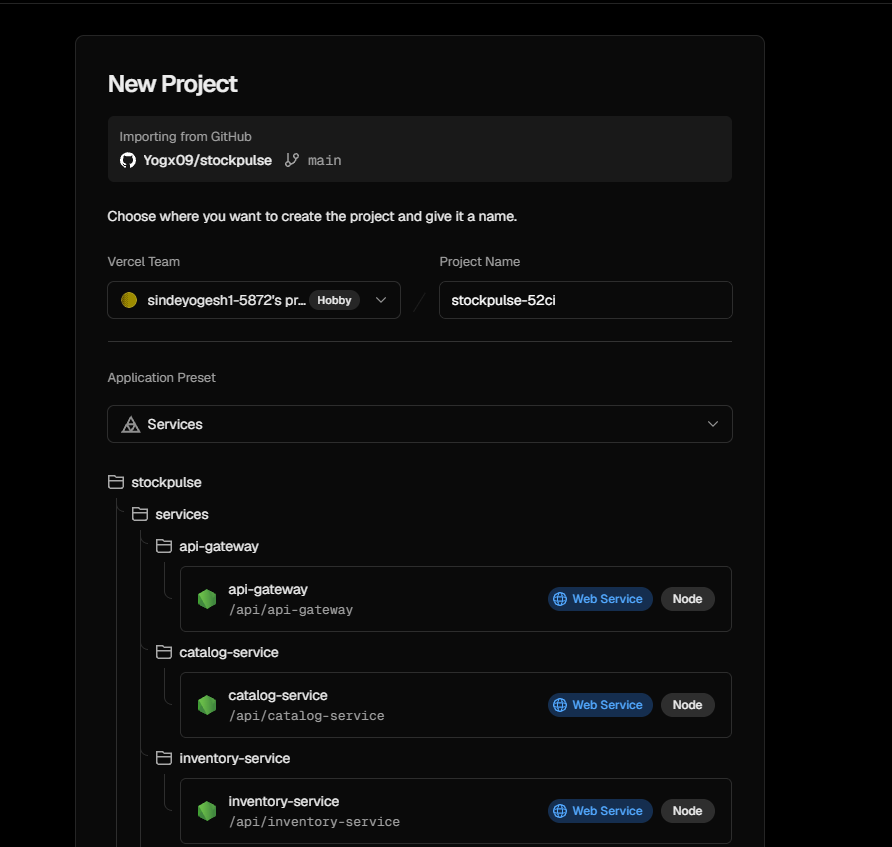
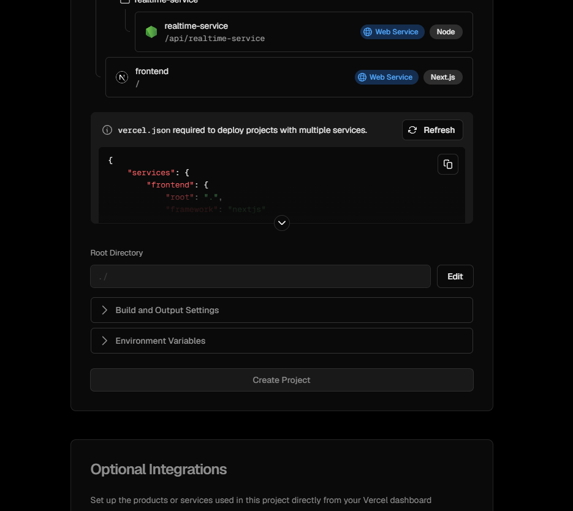
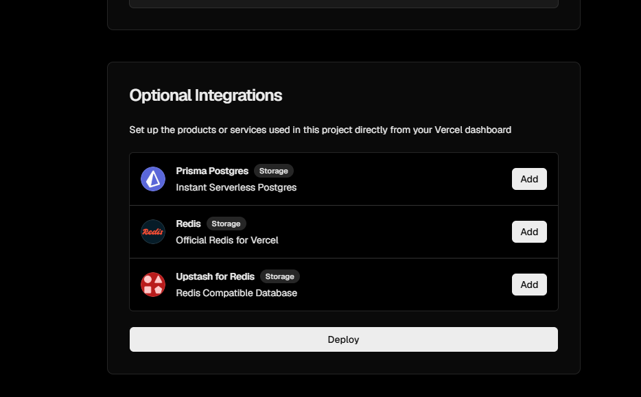
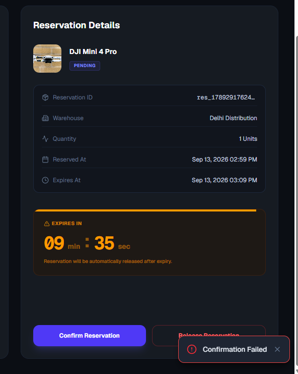
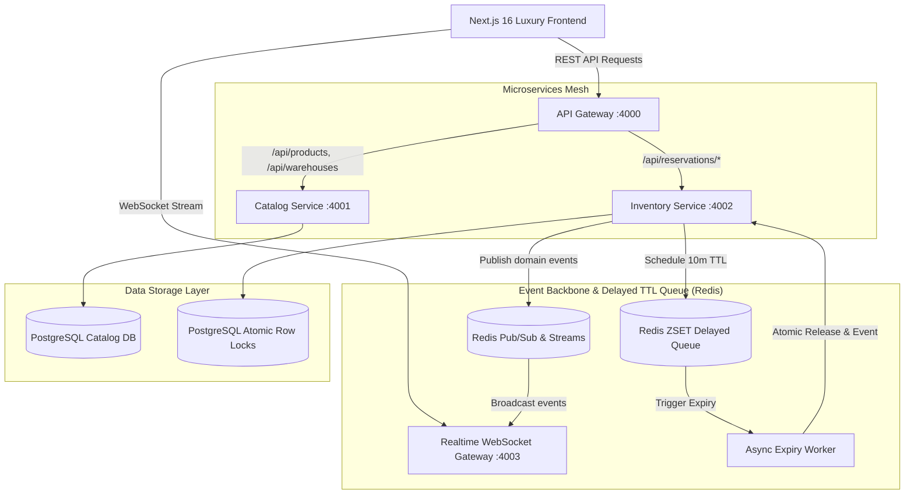

# ⚡ Stockpulse: Distributed Flash-Sale & High-Concurrency Inventory Engine

<div align="center">



[](https://nextjs.org/)
[](https://www.typescriptlang.org/)
[](https://www.postgresql.org/)
[](https://redis.io/)
[](https://www.docker.com/)

**Stockpulse** is an enterprise-grade, event-driven microservices platform engineered for extreme flash-sale traffic, distributed warehouse synchronization, and **100% Zero-Oversell** atomic reservation guarantees.

[Live Demo](#-live-dashboard--ui-tour) • [Architecture](#-system-architecture) • [Microservices](#-microservices-mesh) • [Quick Start](#-quick-start) • [API Reference](#-api-endpoints) • [Documentation](DOCUMENTATION.md)

</div>

---

## 📸 Live Dashboard & UI Tour

<div align="center">

### 1. Executive Inventory & Reservation Command Center
*High-density overview with live 12-month lock throughput, regional node latencies, and real-time metric counters.*


### 2. High-Density Product Catalog & Warehouse Nodes
*Multi-warehouse allocation, instant 10-minute flash locks, restock replenishment modals, and multi-currency conversion.*


### 3. Compact Lock Inspector & 1-Click Order Confirmation
*Zero-scroll sliding window management with real-time TTL countdowns and inline quick-actions.*


### 4. Parallel Flash-Sale Concurrency Simulator
*Built-in stress testing suite firing 10 to 100 simultaneous atomic requests with zero-oversell verification.*


</div>

---

## 🏗️ System Architecture



---

## 🧩 Microservices Mesh Breakdown

| Service | Port / Protocol | Technology | Responsibilities |
| :--- | :--- | :--- | :--- |
| **API Gateway** | `http://localhost:4000` | Fastify / Reverse Proxy | Unified route orchestration, health checks, rate limiting, and CORS. |
| **Catalog Service** | `http://localhost:4001` | Fastify / PostgreSQL | Product metadata, regional warehouse stock aggregation, and caching. |
| **Inventory Service** | `http://localhost:4002` | Fastify / Prisma / Row Locks | Atomic reservations (`SELECT FOR UPDATE`), checkout confirmations, and releases. |
| **Expiry Worker** | Background Daemon | Node.js / Redis ZSET | Millisecond-precision TTL queue worker automatically releasing expired locks. |
| **Realtime Gateway**| `ws://localhost:4003/ws` | WebSockets / Redis PubSub | Live broadcast feed pushing reservations, orders, and timer ticks. |
| **Frontend Web App** | `http://localhost:3000` | Next.js 16 (App Router) | Luxury responsive dashboard with real-time UI, multi-currency, and export. |

---

## 🔒 Concurrency & Zero-Oversell Guarantees

Stockpulse eliminates overselling under high concurrency through four layered defenses:

1. **Row-Level Atomic Locking**:
   ```sql
   UPDATE "Inventory" 
   SET "reservedStock" = "reservedStock" + $qty 
   WHERE "id" = $inventoryId AND ("totalStock" - "reservedStock") >= $qty;
   ```
2. **Distributed Redis Idempotency**: Every reservation request checks an `Idempotency-Key` header with TTL caching to avoid double charges on network retries.
3. **Decoupled 10-Minute Expiry Engine**: Non-blocking Redis Sorted Set (`ZSET`) queue triggers automatic release without expensive table scans.
4. **Optimistic UI with Realtime Sync**: Immediate feedback on lock actions paired with WebSocket broadcasts to synchronize all active clients.

---

## 🚀 Quick Start

### Prerequisites
- Node.js 18+ or 20+
- npm or pnpm
- (Optional) Docker & Docker Compose for containerized deployment

### 1. Installation
```bash
git clone https://github.com/Yogx09/stockpulse.git
cd stockpulse
npm install
```

### 2. Run the Full Mesh + Frontend
```bash
# Starts API Gateway, Catalog, Inventory, Expiry Worker, Realtime Gateway, and Next.js
npm run dev:all
```

The web dashboard will be available at **`http://localhost:3000`**.

### 3. Run Individual Microservices (Modular Scaling)
```bash
npm run dev:gateway      # Port 4000
npm run dev:catalog      # Port 4001
npm run dev:inventory    # Port 4002
npm run dev:realtime     # Port 4003
npm run dev:expiry       # Background Worker
```

### 4. Run Automated Integration & Concurrency Tests
```bash
npm run test:services
```
*Executes all 9 end-to-end integration tests: catalog fetching, atomic locking, idempotency keys, confirmation workflows, and parallel race-condition verification.*

### 5. Production Docker Compose
```bash
docker-compose up --build
```

---

## 📡 API Endpoints

### Catalog Service (`:4001` or `:4000/api/products`)
- `GET /api/products` — Retrieve all products with aggregated warehouse inventory.
- `GET /api/warehouses` — List all distributed fulfillment nodes.

### Inventory Service (`:4002` or `:4000/api/reservations`)
- `GET /api/reservations` — List active, confirmed, and expired reservation locks.
- `POST /api/reservations` — Atomically reserve stock for 10 minutes (`headers: { "Idempotency-Key": "..." }`).
- `POST /api/reservations/:id/confirm` — Confirm lock and transition to finalized order.
- `POST /api/reservations/:id/release` — Cancel reservation and return stock to warehouse.
- `POST /api/inventory/restock` — Replenish inventory units for a warehouse node.
- `POST /api/inventory/simulate-concurrency` — Trigger simulated parallel bursts.

### Realtime Gateway (`:4003`)
- `ws://localhost:4003/ws` — Real-time event stream broadcasting JSON events:
  - `RESERVATION_CREATED`
  - `RESERVATION_CONFIRMED`
  - `RESERVATION_EXPIRED`
  - `RESERVATION_RELEASED`
  - `STOCK_UPDATED`

---

## 🛠️ Tech Stack

- **Frontend**: Next.js 16 (App Router, Turbopack), React 19, TypeScript, Tailwind CSS, Framer Motion, Lucide Icons.
- **Backend**: Node.js, TypeScript, Fastify, tsx.
- **Database & ORM**: PostgreSQL, Prisma ORM.
- **Caching & Messaging**: Redis Pub/Sub, Redis Sorted Sets (ZSET), WebSockets.
- **DevOps & Testing**: Docker, Docker Compose, Vitest / Custom Test Runners.

---

## 📄 Documentation

For deep technical architecture, database schemas, and distributed locking flowcharts, see [**DOCUMENTATION.md**](DOCUMENTATION.md).

---

## 📜 License

MIT License © 2026 Stockpulse Team.
